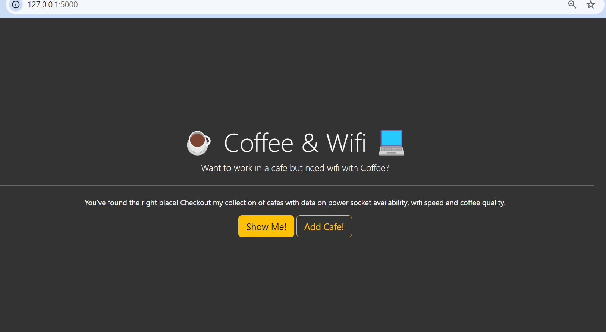
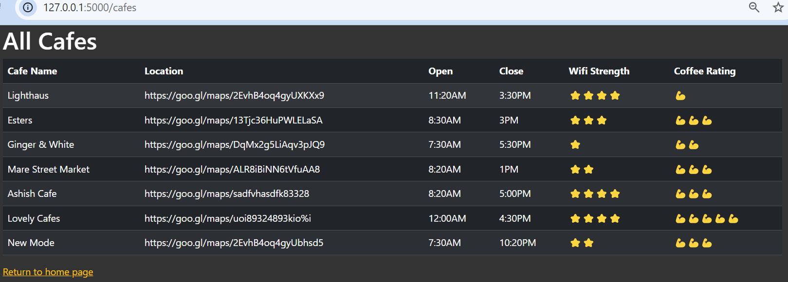
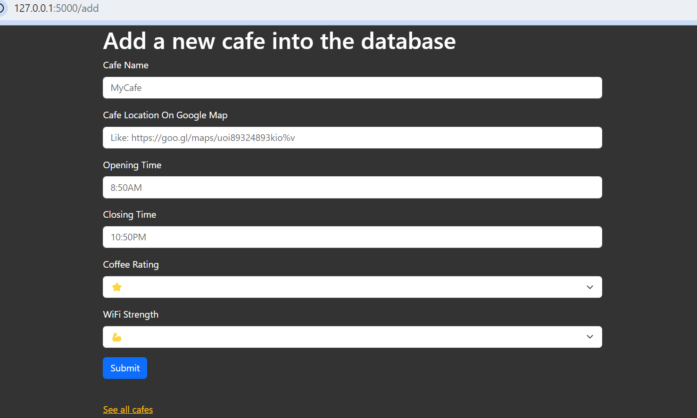

# Cafe Management System

This Flask web application allows users to manage cafe information, including adding new cafes and viewing a list of existing cafes. Users can input details such as the cafe name, location, opening and closing times, and ratings.

## Project Structure

- `main.py`: The main application file containing Flask routes and logic.
- `secret_key.py`: Contains the secret key for Flask sessions (ensure this file is excluded from version control for security reasons).
- `cafe-data.csv`: CSV file that stores cafe data. Updated via the web form.
- `static/`: Directory for static files such as images and CSS.
  - `static/img/`: Directory for image assets.
    - `home_page_preview.png`: Preview image 1
    - `add_cafe_preview.png`: Preview image 2
    - `saved_cafe_preview.png`: Preview image 3
  - `static/css/`: Directory for CSS files.
    - `styles.css`: Custom styles for the application.
- `templates/`: Directory for HTML templates.
  - `index.html`: Home page template.
  - `cafes.html`: Template for displaying the list of cafes.
  - `add.html`: Template for the form to add a new cafe.
  - `error.html`: Template for displaying error messages.
- `.gitignore`: Specifies files and directories to be ignored by Git.
- `README.md`: This file.

## Preview

Below are previews of the images used in the project:





## Installation

### Prerequisites

- Python 3.x
- Pip (Python package installer)

### Setup

1. **Clone the Repository**

   ```bash
   git clone https://github.com/yourusername/your-repository.git
   cd your-repository